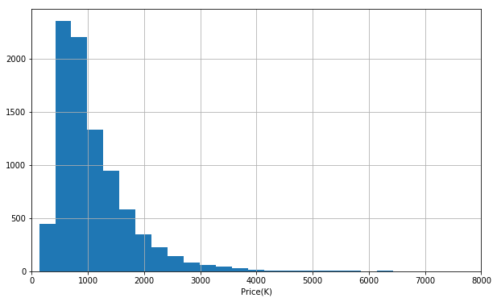
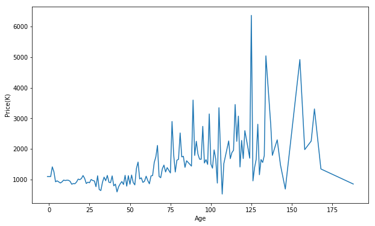
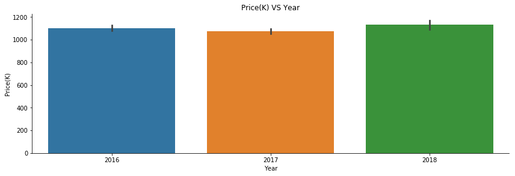
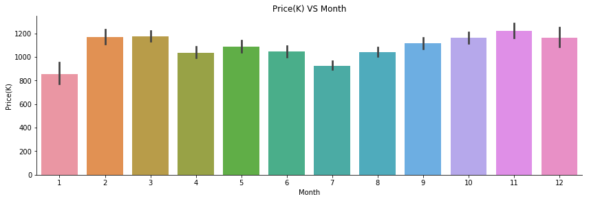
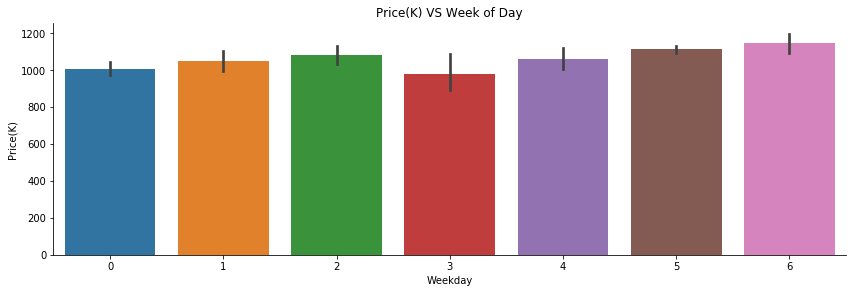
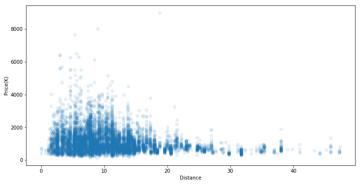
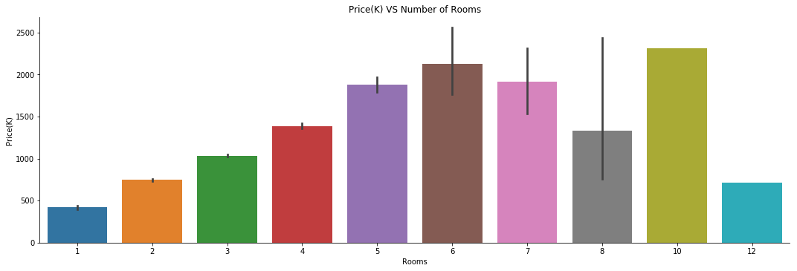
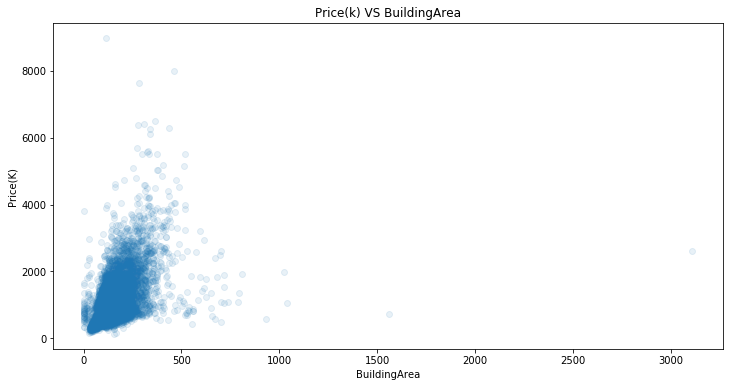
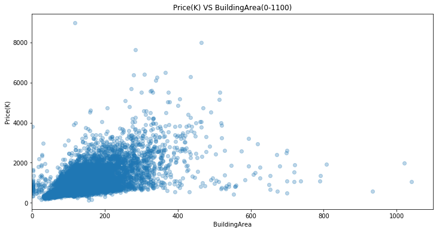

# Data Visualization

This part we will continue doing data exploration on Melbourne Housing dataset. 

First, let's import packages, load dataset and complete data cleaning as we did last time.


```python
import pandas as pd
import matplotlib.pyplot as plt
import numpy as ny
import seaborn as sns

#load dataset
housing = pd.read_csv('housing.csv')
#filter rows whose buildingarea is zero
housing = housing[housing['BuildingArea']!=0]
#drop three columns
housing = housing.drop(['Address','SellerG','Bedroom2'],axis = 1) 
#get age of property
housing['Age'] = 2018-housing['YearBuilt']
#filter one 420-year-old property 
housing = housing[housing['Age']<500]
#extract Year, Month, Day from Date. First, you have to change string into datetime object
housing['Date']=pd.to_datetime(housing['Date'],infer_datetime_format=True)  ## transform Date column to datetime object
housing['Year']=pd.DatetimeIndex(housing['Date']).year
housing['Month']=pd.DatetimeIndex(housing['Date']).month
housing['Weekday']=pd.DatetimeIndex(housing['Date']).weekday
#finally, drop all NAN
housing=housing.dropna()
#Take a look!
housing.head()

```


<div>
<style scoped>
    .dataframe tbody tr th:only-of-type {
        vertical-align: middle;
    }

    .dataframe tbody tr th {
        vertical-align: top;
    }

    .dataframe thead th {
        text-align: right;
    }
</style>
<table border="1" class="dataframe">
  <thead>
    <tr style="text-align: right;">
      <th></th>
      <th>Suburb</th>
      <th>Rooms</th>
      <th>Type</th>
      <th>Price</th>
      <th>Method</th>
      <th>Date</th>
      <th>Distance</th>
      <th>Postcode</th>
      <th>Bathroom</th>
      <th>Car</th>
      <th>...</th>
      <th>YearBuilt</th>
      <th>CouncilArea</th>
      <th>Lattitude</th>
      <th>Longtitude</th>
      <th>Regionname</th>
      <th>Propertycount</th>
      <th>Age</th>
      <th>Year</th>
      <th>Month</th>
      <th>Weekday</th>
    </tr>
  </thead>
  <tbody>
    <tr>
      <th>2</th>
      <td>Abbotsford</td>
      <td>2</td>
      <td>h</td>
      <td>1035000.0</td>
      <td>S</td>
      <td>2016-04-02</td>
      <td>2.5</td>
      <td>3067.0</td>
      <td>1.0</td>
      <td>0.0</td>
      <td>...</td>
      <td>1900.0</td>
      <td>Yarra City Council</td>
      <td>-37.8079</td>
      <td>144.9934</td>
      <td>Northern Metropolitan</td>
      <td>4019.0</td>
      <td>118.0</td>
      <td>2016</td>
      <td>4</td>
      <td>5</td>
    </tr>
    <tr>
      <th>4</th>
      <td>Abbotsford</td>
      <td>3</td>
      <td>h</td>
      <td>1465000.0</td>
      <td>SP</td>
      <td>2017-04-03</td>
      <td>2.5</td>
      <td>3067.0</td>
      <td>2.0</td>
      <td>0.0</td>
      <td>...</td>
      <td>1900.0</td>
      <td>Yarra City Council</td>
      <td>-37.8093</td>
      <td>144.9944</td>
      <td>Northern Metropolitan</td>
      <td>4019.0</td>
      <td>118.0</td>
      <td>2017</td>
      <td>4</td>
      <td>0</td>
    </tr>
    <tr>
      <th>6</th>
      <td>Abbotsford</td>
      <td>4</td>
      <td>h</td>
      <td>1600000.0</td>
      <td>VB</td>
      <td>2016-04-06</td>
      <td>2.5</td>
      <td>3067.0</td>
      <td>1.0</td>
      <td>2.0</td>
      <td>...</td>
      <td>2014.0</td>
      <td>Yarra City Council</td>
      <td>-37.8072</td>
      <td>144.9941</td>
      <td>Northern Metropolitan</td>
      <td>4019.0</td>
      <td>4.0</td>
      <td>2016</td>
      <td>4</td>
      <td>2</td>
    </tr>
    <tr>
      <th>11</th>
      <td>Abbotsford</td>
      <td>3</td>
      <td>h</td>
      <td>1876000.0</td>
      <td>S</td>
      <td>2016-07-05</td>
      <td>2.5</td>
      <td>3067.0</td>
      <td>2.0</td>
      <td>0.0</td>
      <td>...</td>
      <td>1910.0</td>
      <td>Yarra City Council</td>
      <td>-37.8024</td>
      <td>144.9993</td>
      <td>Northern Metropolitan</td>
      <td>4019.0</td>
      <td>108.0</td>
      <td>2016</td>
      <td>7</td>
      <td>1</td>
    </tr>
    <tr>
      <th>14</th>
      <td>Abbotsford</td>
      <td>2</td>
      <td>h</td>
      <td>1636000.0</td>
      <td>S</td>
      <td>2016-08-10</td>
      <td>2.5</td>
      <td>3067.0</td>
      <td>1.0</td>
      <td>2.0</td>
      <td>...</td>
      <td>1890.0</td>
      <td>Yarra City Council</td>
      <td>-37.8060</td>
      <td>144.9954</td>
      <td>Northern Metropolitan</td>
      <td>4019.0</td>
      <td>128.0</td>
      <td>2016</td>
      <td>8</td>
      <td>2</td>
    </tr>
  </tbody>
</table>
<p>5 rows × 22 columns</p>
</div>


```python
housing.info()
```

    <class 'pandas.core.frame.DataFrame'>
    Int64Index: 8841 entries, 2 to 34856
    Data columns (total 22 columns):
    Suburb           8841 non-null object
    Rooms            8841 non-null int64
    Type             8841 non-null object
    Price            8841 non-null float64
    Method           8841 non-null object
    Date             8841 non-null datetime64[ns]
    Distance         8841 non-null float64
    Postcode         8841 non-null float64
    Bathroom         8841 non-null float64
    Car              8841 non-null float64
    Landsize         8841 non-null float64
    BuildingArea     8841 non-null float64
    YearBuilt        8841 non-null float64
    CouncilArea      8841 non-null object
    Lattitude        8841 non-null float64
    Longtitude       8841 non-null float64
    Regionname       8841 non-null object
    Propertycount    8841 non-null float64
    Age              8841 non-null float64
    Year             8841 non-null int64
    Month            8841 non-null int64
    Weekday          8841 non-null int64
    dtypes: datetime64[ns](1), float64(12), int64(4), object(5)
    memory usage: 1.6+ MB
    

Let us rescale price column in to Price(k)


```python
housing['Price(K)'] = housing['Price']/1000
housing.drop('Price',axis = 1,inplace=True) 
```

** Dataset is ready for visualize. **

### Show, don't tell!

## Viz 1

This plot will show the distribution of Price(K)


```python
plt.figure(figsize=(10,6))
ax1=housing['Price(K)'].hist(bins=31)
ax1.set_xlabel('Price(K)')
ax1.set_xlim([0,8000])
```


    (0, 8000)





## Viz 2

Price(K) VS Age of Property


```python
plt.figure(figsize=(10,6))
ax2=housing.groupby('Age')['Price(K)'].mean().plot()
ax2.set_ylabel('Price(K)')
```


    Text(0,0.5,'Price(K)')





It is kind of time series data. The price shivers within age. However, we can still infer that the older the property is, the more expensive is if the age is lower than 125. The property older thatn 130 seems to be as expensive as the ones 50 years old.

## Viz 3

Price(K) VS Year, Month, and Weekday


```python
plt.figure(figsize=(10,6))
g1=sns.factorplot(y='Price(K)',x='Year',kind='bar',size=4, aspect =3,data=housing)
g1.ax.set_title('Price(K) VS Year')
```


    Text(0.5,1,'Price(K) VS Year')


    <matplotlib.figure.Figure at 0x2629916b6d8>





```python
plt.figure(figsize=(10,6))
g2=sns.factorplot(y='Price(K)',x='Month',kind='bar',size=4, aspect =3,data=housing)
g2.ax.set_title('Price(K) VS Month')
```


    Text(0.5,1,'Price(K) VS Month')


    <matplotlib.figure.Figure at 0x26298ee8518>





```python
plt.figure(figsize=(10,6))
g3=sns.factorplot(y='Price(K)',x='Weekday',kind='bar',size=4, aspect =3,data=housing)
g3.ax.set_title('Price(K) VS Week of Day')
```


    Text(0.5,1,'Price(K) VS Week of Day')


    <matplotlib.figure.Figure at 0x26299488668>





```python
plt.figure(figsize=(16,6))
g4=sns.factorplot(y='Price(K)',x='Month',kind='bar',hue='Weekday',size=5, aspect =3,data=housing)
g4.ax.set_title('Price(K) VS Month')
```


    Text(0.5,1,'Price(K) VS Month')


    <matplotlib.figure.Figure at 0x2629754b0b8>


## Viz 4

Price(K) VS Distance


```python
plt.figure(figsize=(12,6))
sns.regplot(x='Distance',y='Price(K)',data=housing,scatter_kws={'alpha':0.1},fit_reg=False)
```


    <matplotlib.axes._subplots.AxesSubplot at 0x26299bed6a0>





From this plot, we can two main insights:

- Most of properties have distance from 2ish to 15ish unit(miles/kms)
- The further the property is from the CBD, the less value the property has

This justifies the comman sense of the expensive properties in Melbourne CBD. Actually this rule applies to any big city!

## Viz 5

Price(K) VS Number of Rooms


```python
g5=sns.factorplot(y='Price(K)',x='Rooms',kind='bar',size=5, aspect =3,data=housing)
g5.ax.set_title('Price(K) VS Number of Rooms')
```


    Text(0.5,1,'Price(K) VS Number of Rooms')





Actually, we can guess that the more room one property has, the bigger the property is. SO.....Let's Viz6

## Viz6

Price(K) VS Buildingarea


```python
plt.figure(figsize=(12,6))
ax3=sns.regplot(x='BuildingArea',y='Price(K)',data=housing,scatter_kws={'alpha':0.1},fit_reg=False)
ax3.set_title('Price(k) VS BuildingArea')
```


    Text(0.5,1,'Price(k) VS BuildingArea')





Let's take a closer look at x:(0,1000) part. In other words, ignore outliers.


```python
plt.figure(figsize=(12,6))
ax4=sns.regplot(x='BuildingArea',y='Price(K)',data=housing,scatter_kws={'alpha':0.3},fit_reg=False)
ax4.set_xlim((0,1100))
ax4.set_title('Price(K) VS BuildingArea(0-1100)')
```


    Text(0.5,1,'Price(K) VS BuildingArea(0-1100)')





For buildingarea ranging from 0 and 400, it seems to be a positive linear trend. It is not clear due to too many overlapping points.
